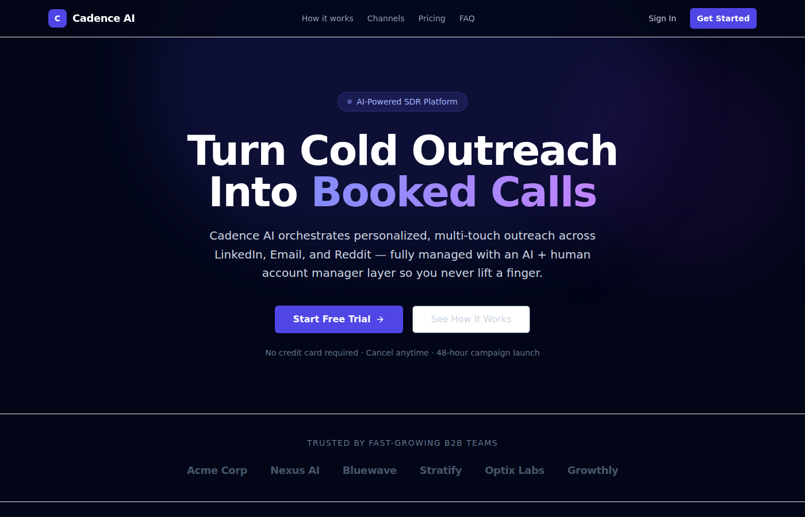
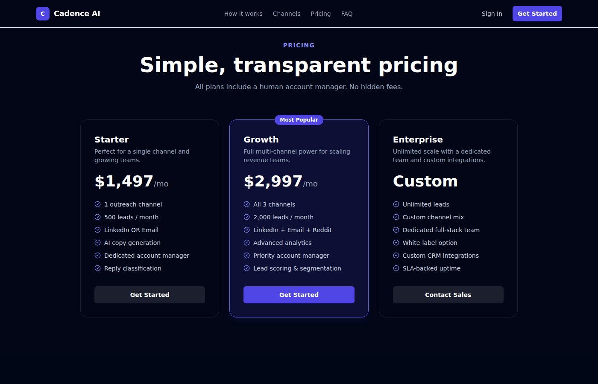
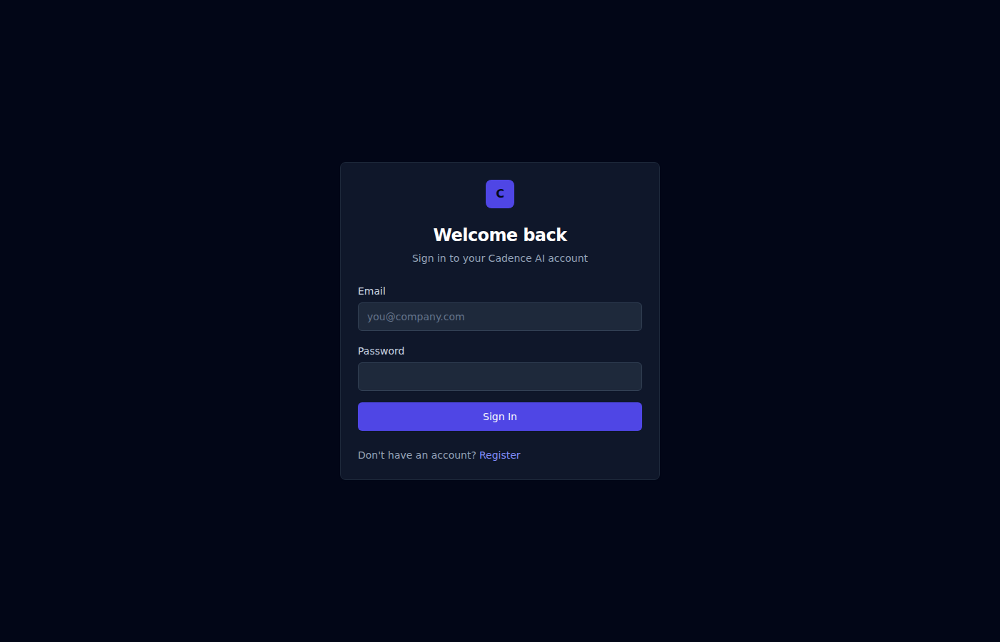
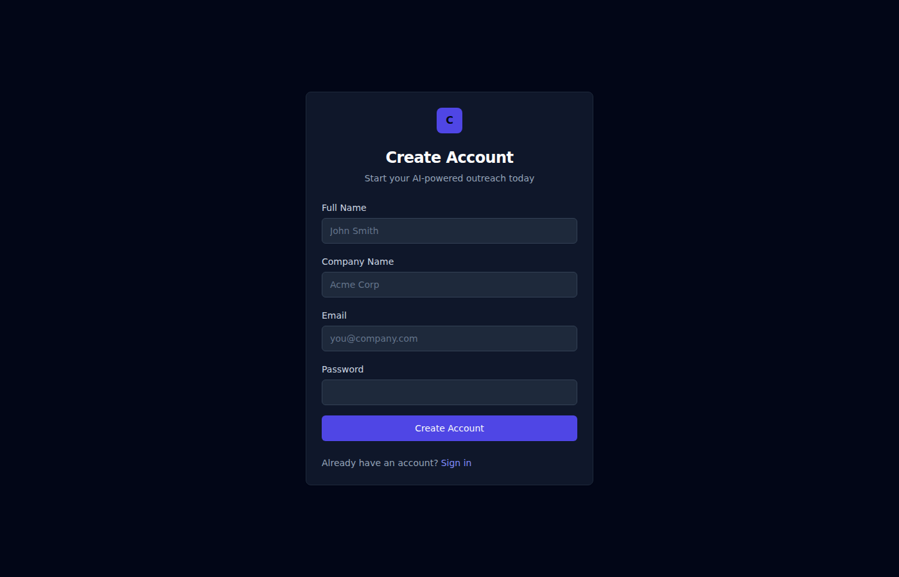

# Cadence AI — Managed AI SDR Platform

Cadence AI orchestrates personalized, multi-touch outreach across **LinkedIn**, **Email**, and **Reddit** in a single dashboard. It combines an AI layer (Claude 3.5 Sonnet) for copy generation and reply classification with a human account manager layer for quality control — so sales teams book more calls without lifting a finger.

## Preview

### Landing Page — Hero


### Landing Page — Pricing


### Login


### Register


## Features

- **Multi-channel outreach** — LinkedIn connection requests + DMs, Email drip sequences, Reddit community DMs
- **AI-generated copy** — every message is personalized to the lead using ICP data and enrichment info
- **Reply classification** — Claude classifies replies as Positive, Neutral, Negative, OOO, or Unsubscribe and updates lead scores automatically
- **Account manager layer** — human review for Reddit outreach and positive-reply escalation
- **Campaign analytics** — send, open, reply, and booking rates per sequence step
- **BullMQ workers** — background workers for email dispatch, LinkedIn outreach, follow-up scheduling, and lead enrichment
- **Stripe billing** — Starter / Growth / Enterprise subscription tiers

## Tech Stack

| Layer | Technology |
|---|---|
| Framework | Next.js 15 (App Router) |
| Database | PostgreSQL + Prisma ORM |
| Queue | BullMQ + Redis |
| AI | Anthropic Claude 3.5 Sonnet |
| Email | SendGrid |
| Auth | NextAuth.js |
| Billing | Stripe |
| UI | Tailwind CSS + Radix UI + framer-motion |

## Getting Started

### Prerequisites

- Node.js 20+
- PostgreSQL database
- Redis instance
- Accounts for: Anthropic, SendGrid, Stripe (optional: LinkedIn, Reddit APIs)

### Setup

```bash
# 1. Install dependencies
npm install

# 2. Copy and fill in environment variables
cp .env.example .env

# 3. Push the Prisma schema to your database
npm run db:push

# 4. Start the development server
npm run dev

# 5. (Optional) Start background workers in a separate terminal
npm run workers
```

Open [http://localhost:3000](http://localhost:3000) to see the landing page.  
Register at `/register` and complete onboarding to create your first campaign.

### Environment Variables

See `.env.example` for the full list. Key variables:

| Variable | Description |
|---|---|
| `DATABASE_URL` | PostgreSQL connection string |
| `REDIS_URL` | Redis connection string |
| `ANTHROPIC_API_KEY` | Anthropic API key for Claude |
| `SENDGRID_API_KEY` | SendGrid API key |
| `NEXTAUTH_SECRET` | Random secret for NextAuth |
| `STRIPE_SECRET_KEY` | Stripe secret key (billing) |

## Project Structure

```
app/                  Next.js App Router pages and API routes
├── api/              REST API endpoints
├── dashboard/        Authenticated client dashboard
├── page.tsx          Public marketing landing page
components/           Shared React components
lib/
├── services/         Domain services (Campaign, Lead, AI, Billing)
├── integrations/     Third-party integrations (SendGrid, LinkedIn, Reddit)
├── queue/            BullMQ queue definitions
├── redis.ts          Shared Redis connection
prisma/
└── schema.prisma     Database schema
workers/              BullMQ background workers
```

## Architecture

Cadence AI is split into two processes:

1. **Next.js server** (`npm run dev`) — handles the web UI and REST API
2. **Worker process** (`npm run workers`) — runs BullMQ consumers for email dispatch, LinkedIn/Reddit outreach, reply processing, follow-up scheduling, and copy generation

Both processes share the same PostgreSQL database and Redis instance.